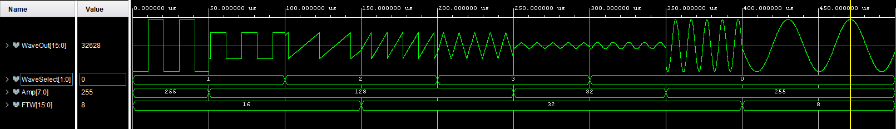

# DDS-VHDL

*Direct Digital Synthesis algorithm implementation in VHDL*

## Inputs
|     Name     |                   Type                   |             Description            |
|:------------:|:----------------------------------------:|:----------------------------------:|
| g_ACC_WIDTH  | Integer                                  | Bit width of the accumulator       |
| i_Clk        | Std_Logic                                | Module clock                       |
| i_Enable     | Std_Logic                                | Enable the oscillator              |
| i_Amp        | Std_Logic_Vector(7 downto 0)             | Amplitude selection (0 to 255)     |
| i_FTW        | Std_Logic_Vector(g_ACC_WIDTH-1 downto 0) | Frequency Tuning Word              |
| i_WaveSelect | Std_Logic_Vector(1 downto 0)             | Select the desired output waveform |

## Output

|  Name  |              Type             |          Description          |
|:------:|:-----------------------------:|:-----------------------------:|
| o_Wave | Std_Logic_Vector(15 downto 0) | 16-bit signed output waveform |

-----

Depending on i_WaveSelect the output signal will be:
- "00": Sine
- "01": Square
- "10": Sawtooth
- "11": Triangle

The frequency of the output signal is given by the following formula:

where *Fs* is the i_Clk frequency and *n* is the accumulator width (g_ACC_WIDTH).

Given *Fs* and *n*, for a desired output frequency you have select FTW as:

## Simulation
